# Koffer OpenShift Infra Artifact Collector
## Provides
This automation provides a unified and standardized tarball of artifacts for
airgap infrastructure deployment tasks.

## About
Koffer OpenShift uses the Koffer runtime container to enable streamlined 
low side capture of all required artifacts for deploying OpenShift 
infrastructure to "high side" airgaped environments in a standard 
"registry < to > mirror" workflow model.

Features:
  - High side service enablemet via `cloudctl` podman pod running:
    - ContainerOne user automation deployment and development workspace
    - Generic Docker Registry:2 for serving pre-hydrated image content
    - Nginx for serving CoreOS Ignition files
  - High side automation for automatic pod standup on CoreOS or any Podman capable host
  - High side sha256 verification of artifacts bundle before standup
  - Low side injestion to "pre-hydrated" registry stateful path

## Run
### 1. Clone into koffer directory
```
 git clone https://repo1.dsop.io/dsop/redhat/platformone/ocp4x/ansible/bundle.git /tmp/koffer;
 git checkout nightlies;
```
### 2. Run Koffer
```
sudo podman run \
    --rm -qit -h koffer --name koffer     \
    --pull=always --entrypoint entrypoint \
    --volume ~/.docker:/root/.docker:z    \
    --volume /tmp/koffer:/root/koffer:z   \
  docker.io/containercraft/koffer:nightlies
```
  - optional: volume mount quay pull secret from host    
    `--volume ~/.docker:/root/.docker/`
### 3. Move Koffer Bundle to target host /tmp directory
### 4. Aquire root & unpack tarball
```
sudo -i
```
```
tar -xv -C /root -f /tmp/koffer-bundle.*.tar
```
### 5. Run CloudCtl stand up script
```
 ./start-cloudctl.sh
```
#### 6. Exec into CloudCtl
```
 podman exec -it cloudctl-one connect
```
# [Developer Docs & Utils](./dev)
# Demo

